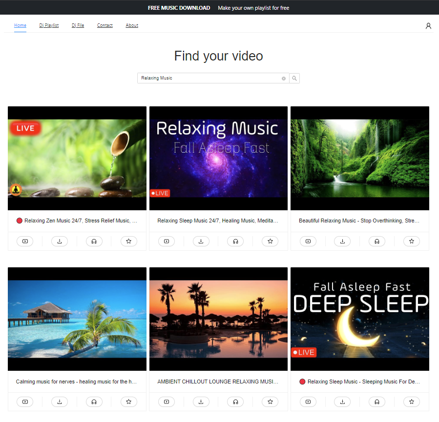
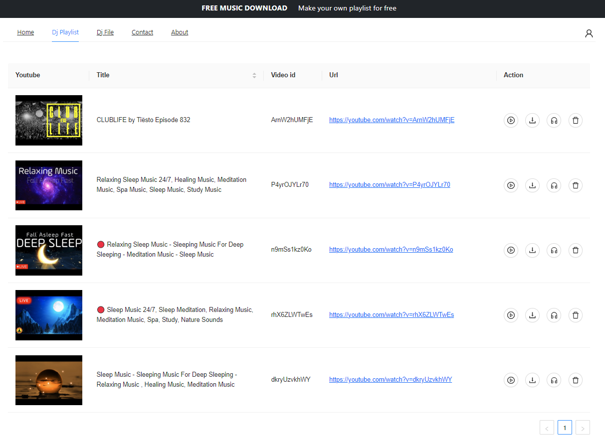

# The Dj-Studio Web Application

The Dj-Studio is a web application that allows users to save YouTube videos and audio tracks to their device for offline viewing or listening. This feature can be especially useful for users who want to watch or listen to content on the go or have limited internet access.

## Features

- Users can search for YouTube videos and audio tracks using keywords
- Users can save the video or audio track to their device for offline viewing or listening
- Supports user authorization and authentication
- Uses Django for the backend
- Uses React for the frontend
- Uses SQLite database

## Installation

To install and run this app on your local machine, follow these steps:

1. Clone the repository to your local machine:
- git clone https://github.com/your_username/DJ-Studio.git
3. Install the required dependencies for the backend:
- cd backend 
- pip install -r requirements.txt
4. Install the required dependencies for the frontend: 
- cd frontend 
- npm install
6. Start the backend server: 
- python manage.py runserver 127.0.0.1:7000
7. Start the frontend server: 
- npm start
9. Navigate to http://localhost:3000 in your web browser to use the application

## Usage

To use the Dj-Studio web application, follow these steps:

1. (Optional) Register or login to your account. This will give you access to additional features such as saving your search history and creating playlists.
2. Use the search bar to search for YouTube videos or audio tracks using keywords.
3. Click on the "Download" button to download the video or audio track to your device.
4. To view or listen to your saved content, navigate to the "Playlist" section. You can access this section by clicking on the "Playlist" link in the navigation menu after login.

## Contributing

We welcome contributions to this app. Here's how to get started:

1. Fork this repository to your own GitHub account.
2. Clone the repository to your local machine.
3. Create a new branch for your feature/bugfix/refactor/etc.
4. Commit your changes to your branch.
5. Push your changes to your forked repository.
6. Open a pull request to this repository and describe the changes you made.

## Credits

Dj-Studio was created by Nikos Avgeros.
